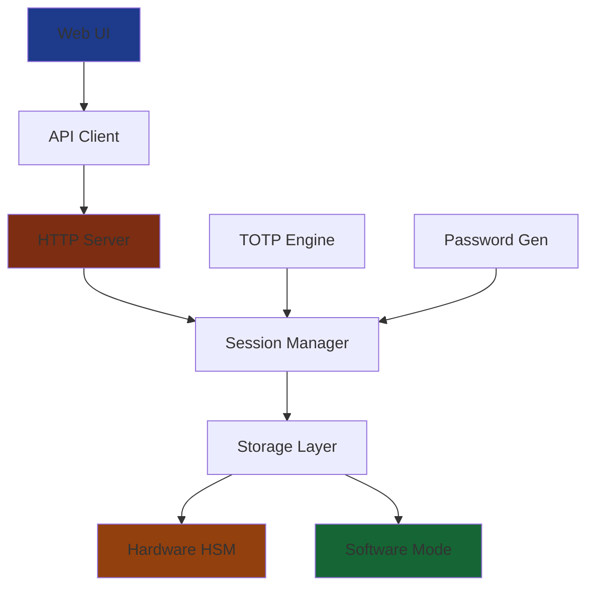

---
# try also 'default' to start simple
theme: seriph
# random image from a curated Unsplash collection by Anthony
# like them? see https://unsplash.com/collections/94734566/slidev
background: https://source.unsplash.com/1920x1080/?security,technology
# apply any windi css classes to the current slide
class: 'text-center'
# https://sli.dev/custom/highlighters.html
highlighter: shiki
# show line numbers in code blocks
lineNumbers: false
# some information about the slides, markdown enabled
info: |
  ## PassBox - Post-Quantum Secure Password Manager
  
  Hardware-backed cryptographic API for the quantum-safe future.

# persist drawings in exports and build
drawings:
  persist: false
# page transition
transition: slide-left
# use UnoCSS
css: unocss
---

# PassBox
## Post-Quantum Secure Password Manager

🛡️ **Hardware-backed cryptographic API for the quantum-safe future**

<div class="pt-12">
  <span @click="$slidev.nav.next" class="px-2 py-1 rounded cursor-pointer" hover="bg-white bg-opacity-10">
    Start Presentation <carbon:arrow-right class="inline"/>
  </span>
</div>

<div class="abs-br m-6 flex gap-2">
  <button @click="$slidev.nav.openInEditor()" title="Open in Editor" class="text-xl slidev-icon-btn opacity-50 !border-none !hover:text-white">
    <carbon:edit />
  </button>
  <a href="https://github.com/team-aica/passbox" target="_blank" alt="GitHub"
    class="text-xl slidev-icon-btn opacity-50 !border-none !hover:text-white">
    <carbon-logo-github />
  </a>
</div>

---
transition: fade-out
---

# The Quantum Threat is Real

<v-clicks>

- 🏛️ **Government agencies** are already investing billions in quantum computers
- 🔐 **Current encryption** (RSA, ECDH) will be **broken** by quantum computers
- ⏰ **"Store now, decrypt later"** attacks are happening today
- 🎯 **NIST** has standardized post-quantum cryptography algorithms

</v-clicks>

<br>

<v-click>

<div class="bg-red-900 border-l-4 border-red-400 text-red-100 p-4 mt-8">
  <p class="font-bold">⚠️ Critical Question:</p>
  <p>Is your sensitive data protected against quantum computers?</p>
</div>

</v-click>

<style>
h1 {
  background-color: #4EC5D4;
  background-image: linear-gradient(45deg, #60A5FA 10%, #3B82F6 20%);
  background-size: 100%;
  -webkit-background-clip: text;
  -moz-background-clip: text;
  -webkit-text-fill-color: transparent;
  -moz-text-fill-color: transparent;
}
</style>

---
layout: default
---

# PassBox Solution Overview

<div class="grid grid-cols-2 gap-8 mt-8">

<div>

## 🔒 **Post-Quantum Cryptography**
- ML-KEM 768/1024 (NIST standardized)
- CRYSTALS-Dilithium signatures
- Quantum-safe by design

## 🏗️ **Hardware Security**
- Zymkey HSM integration
- Secure element protection
- Tamper-resistant storage

</div>

<div>

## 🛡️ **Enterprise Features**
- Password & OTP management
- TOTP code generation
- Session-based security
- RESTful API

## 🌐 **Modern Web UI**
- React + TypeScript
- Real-time session timer
- Mobile-responsive design

</div>

</div>

---
layout: image-right
image: https://source.unsplash.com/800x600/?quantum,computer
---

# Security Architecture

<v-clicks>

## **🌍 Transport Layer**
- ML-KEM 768/1024 (Post-quantum)
- HTTP session protection

## **👤 Application Layer**  
- ML-KEM + ECDH hybrid
- Cross-session persistence

## **🔐 Data Layer**
- XChaCha20-Poly1305 encryption
- Hardware-backed secrets

</v-clicks>

---
layout: center
class: text-center
---

# Live Demo: Password Management

<div class="grid grid-cols-3 gap-4 mt-8">

<div class="bg-blue-900 p-6 rounded-lg text-blue-100">
  <div class="text-4xl mb-4">🔐</div>
  <h3 class="font-bold mb-2">Secure Storage</h3>
  <p class="text-sm">Post-quantum encrypted</p>
</div>

<div class="bg-green-900 p-6 rounded-lg text-green-100">
  <div class="text-4xl mb-4">🎯</div>
  <h3 class="font-bold mb-2">TOTP Generation</h3>
  <p class="text-sm">Real-time 6-digit codes</p>
</div>

<div class="bg-purple-900 p-6 rounded-lg text-purple-100">
  <div class="text-4xl mb-4">⏱️</div>
  <h3 class="font-bold mb-2">Session Timer</h3>
  <p class="text-sm">10-minute auto-expiry</p>
</div>

</div>

---
layout: two-cols
---

# API Endpoints Overview

## 🔑 **Session Management**
```http
POST /session/initiate
POST /session/complete
DELETE /api/session
```

## 🔐 **Password Vault**
```http
POST /passwords/generate
POST /passwords/save
GET  /passwords/load/{id}
GET  /passwords/list
DELETE /passwords/delete/{id}
```

## 📱 **External OTP**
```http
POST /external-otp/save
GET  /external-otp/load/{id}
GET  /external-otp/list
DELETE /external-otp/delete/{id}
```

::right::

# Security Features

## 🛡️ **Memory Protection**
- MemGuard secure enclaves
- Automatic memory wiping

## 🔒 **Encryption Standards**
- AES-256-GCM
- XChaCha20-Poly1305
- HKDF key derivation

## 🏗️ **Hardware Support**
- **Zymkey HSM**: Production mode
- **Software fallback**: Development
- **Cross-platform**: Linux/macOS/Windows

## ⏰ **Session Management**
- 10-minute auto-expiry
- Activity-based renewal

---
layout: default
---

# Use Cases & Target Markets

<div class="grid grid-cols-2 gap-8 mt-8">

<div>

## 🏢 **Enterprise**
- **Financial Services**: Quantum-safe customer data
- **Healthcare**: HIPAA-compliant passwords
- **Government**: Classified information protection
- **Technology**: Secure development environments

## 🔬 **Research & Development**
- **Cryptography Research**: Algorithm testing
- **Security Auditing**: Quantum-safe assessments
- **Academic**: Educational use cases

</div>

<div>

## 🎯 **Key Benefits**

<v-clicks>

- **🛡️ Future-proof**: Quantum-resistant today
- **🔧 Easy Integration**: RESTful API
- **🏗️ Flexible**: Hardware or software mode
- **📱 User-friendly**: Modern web interface
- **⚡ High Performance**: Production optimized
- **🔍 Open Source**: Transparent & auditable

</v-clicks>

</div>

</div>

---
layout: center
class: text-center
---

# Technical Architecture



**Core Stack**: Go + React + ML-KEM + XChaCha20

---
layout: quote
class: text-center
---

# "Security is not a destination, it's a journey. With quantum computers on the horizon, that journey requires post-quantum cryptography."

<div class="text-right mt-8">
<p class="text-lg opacity-80">— Modern Cryptography Principle</p>
</div>

---
layout: default
---

# Competitive Advantages

<div class="grid grid-cols-2 gap-8 mt-8">

<div>

## 🚀 **Innovation Leaders**

<v-clicks>

- **First-to-market** post-quantum password manager
- **NIST-compliant** algorithms (ML-KEM, Dilithium)
- **Hardware integration** with secure elements
- **Dual-layer security** architecture

</v-clicks>

</div>

<div>

## 📊 **Market Differentiation**

<v-clicks>

- **Traditional solutions**: Vulnerable to quantum attacks
- **PassBox**: Quantum-safe from ground up
- **Competitors**: Software-only solutions
- **PassBox**: Hardware-backed security options

</v-clicks>

</div>

</div>

<v-click>

<div class="bg-blue-900 border-l-4 border-blue-400 text-blue-100 p-4 mt-8">
  <p class="font-bold">🎯 Unique Value Proposition</p>
  <p>The only password manager combining post-quantum cryptography with hardware security modules.</p>
</div>

</v-click>

---
layout: two-cols
---

# Development & Deployment

## 🛠️ **Technology Stack**
- **Backend**: Go 1.25+
- **Frontend**: React 18 + TypeScript  
- **Crypto**: ML-KEM, Dilithium, XChaCha20
- **Hardware**: Zymkey HSM
- **Storage**: Pebble (LSM-tree)

::right::

## 🧪 **Quality Assurance**
- Comprehensive unit tests
- Integration test suite
- Algorithm validation
- Hardware compatibility
- Memory safety verification

## 📈 **Performance**
- **Key Exchange**: <100ms
- **Encryption**: >1GB/s
- **Memory**: <512MB baseline
- **Sessions**: 1000+ concurrent
- **Timeout**: 10 minutes

---
layout: center
class: text-center
---

# Get Started Today

<div class="grid grid-cols-2 gap-12 mt-12">

<div>
  <h2 class="text-2xl font-bold mb-6">🚀 For Developers</h2>
  
  ```bash
  # Repository currently in private development
  # Source code will be available upon release
  
  # Core features under active development:
  # - Post-quantum cryptographic implementation
  # - Hardware HSM integration & testing
  # - Modern React-based user interface
  # - Production-grade security protocols
  
  # Stay tuned for the official release!
  ```
  
</div>

<div>
  <h2 class="text-2xl font-bold mb-6">🏢 For Enterprises</h2>
  
  <div class="bg-gray-800 p-6 rounded-lg text-gray-100">
    <p class="mb-4">Ready for production deployment?</p>
    <ul class="text-left space-y-2">
      <li>✅ Hardware HSM integration</li>
      <li>✅ Custom deployment support</li>
      <li>✅ Security audit available</li>
      <li>✅ Professional services</li>
    </ul>
  </div>
  
</div>

</div>

<div class="mt-8">
  <a href="https://github.com/team-aica/passbox" class="bg-blue-600 text-white px-8 py-3 rounded-lg hover:bg-blue-700 transition-colors">
    📚 View Documentation & Source Code
  </a>
</div>

---
layout: end
class: text-center
---

# Thank You

## Questions & Discussion

<div class="mt-12 grid grid-cols-3 gap-8">

<div>
  <div class="text-4xl mb-4">🛡️</div>
  <h3 class="font-bold">Quantum-Safe Security</h3>
  <p class="text-sm mt-2">Future-proof your data today</p>
</div>

<div>
  <div class="text-4xl mb-4">🔧</div>
  <h3 class="font-bold">Easy Integration</h3>
  <p class="text-sm mt-2">RESTful API design</p>
</div>

<div>
  <div class="text-4xl mb-4">🚀</div>
  <h3 class="font-bold">Production Ready</h3>
  <p class="text-sm mt-2">Enterprise-grade solution</p>
</div>

</div>

<div class="abs-br m-6 flex gap-2">
  <a href="https://github.com/team-aica/passbox" target="_blank" alt="GitHub"
    class="text-xl slidev-icon-btn opacity-50 !border-none !hover:text-white">
    <carbon-logo-github />
  </a>
</div>

**PassBox** - *Post-Quantum Secure Password Manager*

---